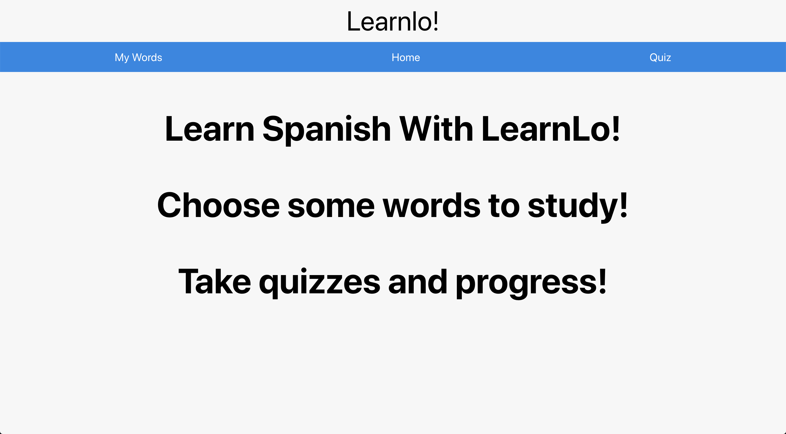
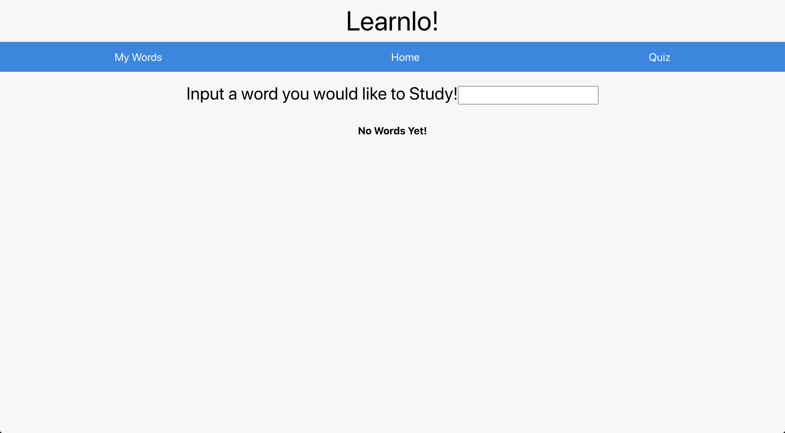
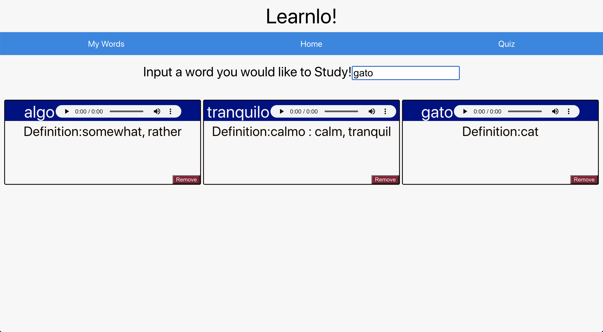
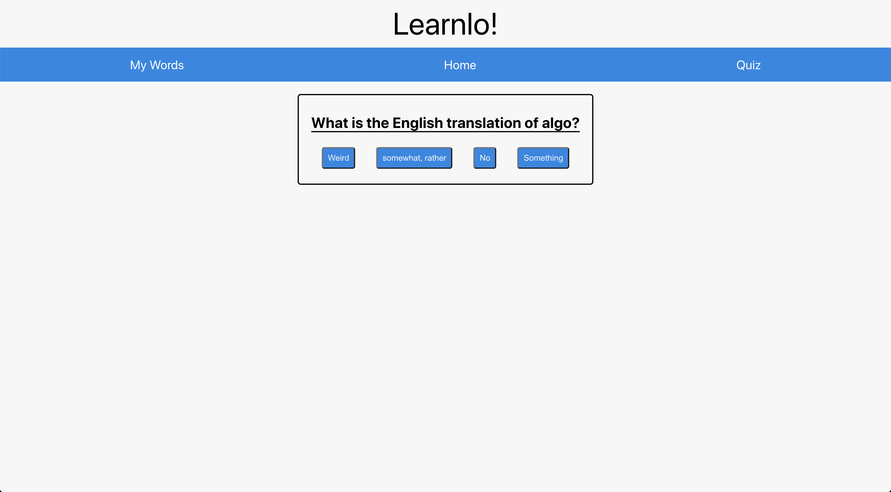
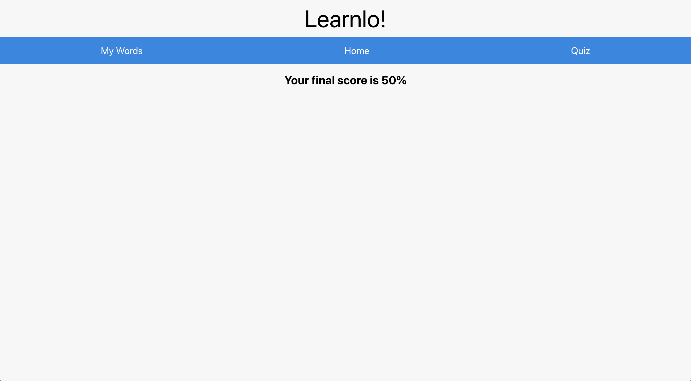

#### LearnLo!

### What is it?

LearnLo is a Spanish learning tool. Users are able to search for words they want to study and create quizzes based on those words. They can take those quizzes and see the score they recieved for their study words. Users can also see the prononciation of the word they want to study.

### Why?

LearnLo was my solo project for the 3rd 6 week module of Turing. Our project guideline was that we had to request data from an API and display that data in an iteractive way while using React. 

### In action

This is the home screen a user sees when they first arrive

This is a blank words area

This is a filled word area

This is a Quiz area

This is a the final score

### Extensions

I hope to continue developing Learnlo with more features. The first feature I would like to add would be a homscreen that displyed a users dashboard of all the quizes they have taken and their progress as well as other relevent language learning tools. I would also like to give users the oppurtunity to select the exact word they want to study instead of relying on the search bar. I would also like to add the abilty for a user to create folders of different words they want to study as well as the oppurtunity to create there own words. Finally I would like to add the ability for a user to log in and out.

## Build with Merriam-Webster Spanish-English Dictionary API 

